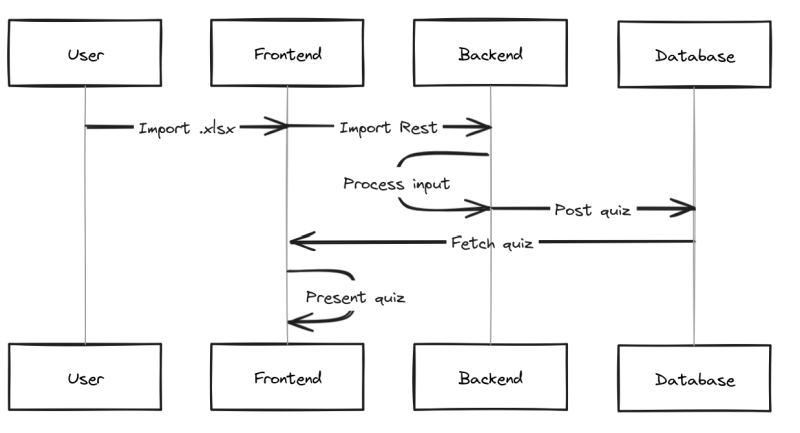
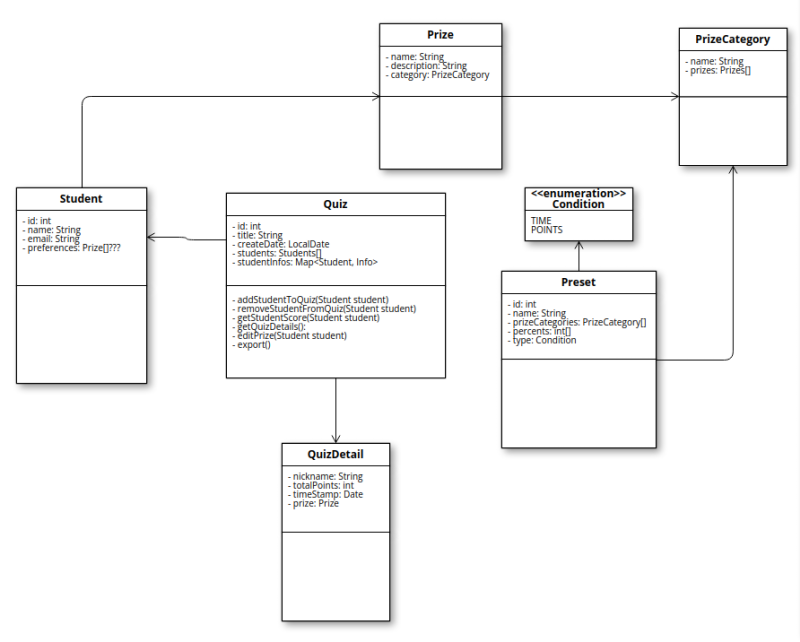
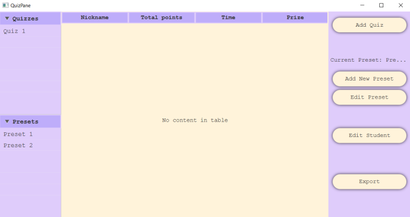

# StatQuizz

Technologie Obiektowe - AGH 2023/2024 - Projekt
- Sebastian Piaskowy
- Norbert Żmija
- Zofia Lenart

## Opis

**StatQuizz** to aplikacja przeznaczona do przetwarzania, analizowania i zarządzania danymi z quizów. Ułatwia importowanie quizów, generowanie szczegółowych statystyk wyników, przydzielanie nagród zgodnie z zdefiniowanymi kryteriami oraz eksportowanie wyników do formatów PDF i XLSX.

## Cechy

- **Wczytywanie Quizów**: Importowanie quizow do analizy.
- **Generowanie Statystyk**: Twórzenie raportów z wynikami quizów, obejmujące średnie wyniki, dystrybucję odpowiedzi i inne kluczowe metryki.
- **Przydzielanie Nagród**: Automatycznie przydzielanie nagród na podstawie osiągnięć uczestników, z opcją konfiguracji kryteriów.
- **Eksport Wyników**: Eksportowanie wyników do formatów PDF i XLSX dla dalszej analizy lub archiwizacji.

# Changelog

## 08.12.2023

- Rozrysowaliśmy ogólny schemat jak nasza aplikacja powinna działać na wczesnym etapie.


<br>
<br>

- Wstępnie zaprojektowaliśmy klasy jakimi będziemy się posługiwać w naszej aplikacji.


<br>
<br>

- Zaimplementowaliśmy proste GUI - szkielet widoku naszej aplikacji.


<br>
<br>

## 15.12.2023 - M1 review
### Backend
- Zaimplementowaliśmy prosty backend naszej aplikacji w Spring Boot 3.2.0 z bazą danych, którą wstępnie jest H2. W przyszłości planujemy zmienić ją na SQLite.

- Stworzyliśmy wstępnie dwie encje - Quiz i QuizDetail do przechowywania danych o quizach
```java
@Entity  
@Getter  
@Setter  
@ToString  
@Table(name = "QUIZ")  
@JsonIgnoreProperties("quiz")  
public class Quiz {  
    @Id  
    @GeneratedValue(strategy = GenerationType.IDENTITY)  
    private Long id;  
    
    @Column(name = "created-at")  
    private LocalDateTime createdAt;  
    
    @OneToMany(mappedBy = "quiz", cascade = CascadeType.ALL, orphanRemoval = true)  
    @ToString.Exclude  
    private List<QuizDetail> quizDetails = new ArrayList<>();  
    
    public Quiz() {  
    this.createdAt = LocalDateTime.now();  
    }  
}
```

```java
@Entity  
@Getter  
@Setter  
@ToString  
@AllArgsConstructor  
@NoArgsConstructor  
@Table(name = "QUIZ_DETAILS")  
public class QuizDetail {  
    @Id  
    @GeneratedValue(strategy = GenerationType.IDENTITY)  
    private Long id;  
    private String nickname;  
    private int totalPoints;  
    private long timeDifferenceInSeconds;  
    private String preferences;  
    
    @ManyToOne  
    @JoinColumn(name = "quiz_id")  
    @JsonIgnore  
    private Quiz quiz;  
}
```

- Wystawiliśmy endpoint *createQuiz* do uploadowania plików .xlsx z poziomu frontendu przetwarzania ich do formy modelu oraz endpoint *getAllQuizzes* do pobierania danych wszystkich quizów
```java
@PostMapping("/upload")  
public ResponseEntity<Quiz> createQuiz(@RequestParam("file") MultipartFile file) throws IOException {  
    Map<String, List<String>> responseBody = new HashMap<>();  
    List<String> text = new ArrayList<>();  
    
    if (file.isEmpty()) {  
    return new ResponseEntity<>(HttpStatus.BAD_REQUEST);  
    }  
    
    if (!file.getOriginalFilename().endsWith(".xlsx")) {  
    return new ResponseEntity<>(HttpStatus.BAD_REQUEST);  
    }  
    
    Quiz quizOut = service.getQuizFromFile(file);  
    
    return ResponseEntity.ok(quizOut);  
}
```

```java
@GetMapping("/quiz/all")  
    public List<Quiz> getAllQuizzes() {  
    return quizService.getAllQuizzes();  
}
```

### Frontend
- Dodaliśmy do frontendu naszej aplikacji konsumpcje endpointa GET dla wszystkich quizów. Po uploadowaniu pliku .xlsx quizu pobieramy z bazy dane o wszystkich quizach i prezentujemy je na liście w GUI.
```java
public List<Quiz> fetchQuizzes() {  
    RestTemplate restTemplate = new RestTemplate();  
    String apiUrl = "http://localhost:8080/api/quiz/all";  
    ResponseEntity<Quiz[]> response = restTemplate.getForEntity(apiUrl, Quiz[].class);  
    return Arrays.asList(Objects.requireNonNull(response.getBody()));  
}
```


- Po wybraniu odpowiedniego quizu z listy jego szczegółowe dane takie jak nazwa zwierzaka, punkty, czas wykonania i nagrody wyświetlają się w tabeli obok


<br>
<br>

## 05.01.2024 - M2 review

### Backend
Zmieniliśmy:
  - Model Quiz, jego model pomocniczy QuizEntry został zmodyfikowany o dodatkowe pole z nagrodą.
Dodaliśmy:
  - Modele: Preset, Prize, PrizeCategory
  - Repository do każdego modelu
  - PrizeParser, który parsuje listę preferencji nagród. Wraz z prostym testem.
  - Controllery:
	- PrizeController, który posiada endpointy: dodania nagrody do bazy, wyszukania nagrody po ID, zwrócenia listy wszystkich nagród
    - Endpoint w QuizController obsługujący 2 strategie (X% najlepszych i zależnie od odpowiedzi) 

```java
    @PostMapping("results/{quizId}/{presetId}")
    public ResponseEntity<Long> createQuizResultBasedOnStrategy(@PathVariable(name = "quizId") long quizId,
                                                                       @PathVariable(name = "presetId") long presetId) {
        try {
            return rewardService.getResultsBasedOnStrategy(quizId, presetId)
                    .map(Quiz::getId)
                    .map(ResponseEntity::ok)
                    .orElseGet(() -> ResponseEntity.notFound().build());
        } catch (Exception e) {
            e.printStackTrace();
            return ResponseEntity.status(HttpStatus.INTERNAL_SERVER_ERROR).build();
        }
    }
```

    - PrizeCategoryController zajmujący się obsługą endpointów naszych kategorii, czyli skrzynek. (dodanie, wyszukanie po id, lista wszystkich)
    - PresetController, obsługujący endpointy: dodania presetu, wyszukania po id, wylistowania wszystkich presetów, wylistowania wszystkich presetów z mapowaniem na ID i Name (klasa pomocnicza PresetDescriptorDTO)
  - Klasy pomocnicze (folder request) do dodania Presetu i Kategorii
  - Serwisy:
    - PresetService obsługujący dodawanie nowych Presetów, sprawdzanie, czy dany preset już nie istnieje, wyszukiwanie po ID, pobieranie wszystkich presetów i konwersję na PresetEntity z PresetRequest

```java
public Preset convertToPresetEntity(PresetRequest presetRequest) {
        Preset preset = new Preset();
        preset.setName(presetRequest.getName());
        preset.setStrategy(presetRequest.getStrategy());

        List<PresetEntry> presetEntries = presetRequest.getPresetEntries().stream()
                .map(entryDTO -> {
                    PresetEntry entry = new PresetEntry();

                    entry.setValue(entryDTO.getValue());
                    PrizeCategory prizeCategory = prizeCategoryService.getCategoryById(entryDTO.getCategory())
                            .orElseThrow(() -> new EntityNotFoundException("Category not found with ID: " + entryDTO.getCategory()));
                    entry.setPrizeCategory(prizeCategory);

                    return entry;
                })
                .collect(Collectors.toList());

        preset.setPresetEntries(presetEntries);
        return preset;
    }
```

    - PrizeCategoryService obsługujący dodawanie nowych kategorii (skrzynek), sprawdzanie, czy dana kategoria już nie istnieje,
      wyszukiwanie po ID, pobieranie wszystkich kategorii, konwersję na PresetEntity z PresetRequest i pobieranie samej listy dostępnych dla niej nagród.
    - PrizeService, który wykonuje dodawanie nagród, zwracanie wszystkich, szukanie po ID, sprawdzanie, czy istnieją, zanim dodamy


```java
    public Optional<Prize> checkIfPrizeExists(String prizeName) {
        List<Prize> allPrizes = getAllPrizes();

        return allPrizes.stream()
                .filter(prize -> prize.getName().equalsIgnoreCase(prizeName))
                .findFirst();
    }
```

*W innych serwisach działa to analogicznie

 	- RewardService, które obsługuje 2 strategie przyznawania nagród w zależności od presetu

```java
public Optional<Quiz> getResultsBasedOnStrategy(long quizId, long presetId)
    {
        Optional<Preset> optionalPreset = presetService.getPresetById(presetId);
        if (optionalPreset.isPresent()) {
            Strategy strategy = optionalPreset.get().getStrategy();
            List<PresetEntry> presetEntries = optionalPreset
                    .map(Preset::getPresetEntries)
                    .orElse(Collections.emptyList());

            Optional<Quiz> result = quizService.getQuizById(quizId);
            if (result.isPresent()) {
                if (strategy == Strategy.POINTS) {
                    handleCorrectAnswers(result.get(), presetEntries);
                }
                if (strategy == Strategy.TIME) {
                    handleBestPlayers(result.get(), presetEntries);
                }
                quizRepository.save(result.get());
                return result;
            } else {
                return Optional.empty();
            }
        } else {
            return Optional.empty();
        }
    }
```

Startegia X% najlepszych

```java
    private void handleBestPlayers(Quiz quiz, List<PresetEntry> presetEntries) {
        List<QuizEntry> sortedQuizEntries = quiz.getQuizEntries().stream()
                .sorted(Comparator.comparing(QuizEntry::getCompletingTime))
                .toList();

        int maxPoints = quiz.getQuizEntries().stream()
                .map(QuizEntry::getTotalPoints)
                .max(Integer::compareTo).orElse(-1);

        long numberOfQuizEntries = quiz.getQuizEntries().size();

        int availableNumberOfPeopleWithBestPrize = (int) (numberOfQuizEntries * presetEntries.get(0).getValue());

        int counter = 0;
        for (QuizEntry entry: sortedQuizEntries) {
            if ((counter < availableNumberOfPeopleWithBestPrize) && (maxPoints == entry.getTotalPoints())) {
                entry.setPrize(assignPrize(entry, presetEntries.get(0).getPrizeCategory()));
                counter++;
            }
            else {
                entry.setPrize(assignPrize(entry, presetEntries.get(1).getPrizeCategory()));
            }
            quizEntryRepository.save(entry);
        }
    }
```

Startegia poprawnych odpowiedzi

```java
    private void handleCorrectAnswers(Quiz quiz, List<PresetEntry> presetEntries) {
        for (QuizEntry entry: quiz.getQuizEntries()) {
            int points = entry.getTotalPoints();
            for (PresetEntry categoryWithValue : presetEntries) {
                if(points >= categoryWithValue.getValue()) {
                    entry.setPrize(assignPrize(entry, categoryWithValue.getPrizeCategory()));
                    quizEntryRepository.save(entry);
                }
            }
        }
    }
```


